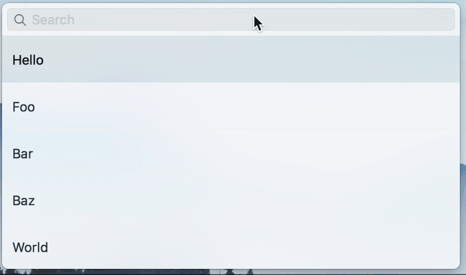

# EJVFilterListWindowController

An NSWindowController subclass that manages a dialog for filtering a list of items. The dialog's content is bound to an NSArrayController that you supply.

## Example

## Usage

The following example shows how to create a dialog and display it:

    // Data that we will be filtering (could be complex objects, we're just using strings for simplicity)
    self.stuff = @[ @"Hello", @"Foo", @"Bar", @"Baz", @"World" ];
    
    // Create the array controller that will supply data to the filter dialog
    self.arrayController = [[NSArrayController alloc] init];
    [self.arrayController bind:NSContentArrayBinding
                      toObject:self
                   withKeyPath:@"stuff"
                       options:nil];

    // Create the dialog
    self.dialog = [[EJVFilterListWindowController alloc]
     initWithArrayController:self.arrayController
     filterPredicateBlock:^NSPredicate * _Nonnull(NSString * _Nonnull searchText) {
	 static NSPredicate *predicateTemplate = nil;
         if (!predicateTemplate) {
             predicateTemplate = [NSPredicate predicateWithFormat:@"self contains[cd] $TEXT"];
         }

         return [predicateTemplate predicateWithSubstitutionVariables:@{ @"TEXT" : searchText }];
     }
     cellViewBlock:^NSTableCellView * _Nonnull(NSTableCellView * _Nullable reusingView, id  _Nonnull object) {
         NSTableCellView *cell = (reusingView) ? reusingView : [[NSTableCellView alloc] initWithFrame:NSZeroRect];

	 // An alternative means of providing data to the cell is by establishing bindings to the cell's -objectValue property
         cell.textField.stringValue = object;

         return cell;
    }];

    // Display the dialog
    [self.dialog.window makeKeyAndOrderFront:nil];

When the user select's a cell (either by pressing the enter key or clicking on a cell), an action message will be sent to the dialog's target. The action message is specified in the `selectionCommittedAction` property. To get the selected object, use the -selectedObjects property of the array controller that was initially supplied to the dialog. For example:

    // When the dialog is created
    self.dialog.target = self;
    self.dialog.selectionCommittedAction = @selector(filterDialogDidSelectRow:);

    - (void)filterDialogDidSelectRow:(EJVFilterListWindowController *)sender
    {
        // Get the selected object from the array controller
        NSString *selection = [[self.arrayController selectedObjects] firstObject];
    
        NSLog(@"You selected: %@", selection);
    }

Because the user's selection is bound to the array controller, is possible to observe the array controller's -selectedObjects or -selectionIndex property to get notified when the selection changes. Note, however, that you will be notified even when the user uses the up/down keys to change the highlighted row (which does not send the `selectionCommittedAction` message). This difference in behavior could be used, for example, to provide a preview of an item that is highlighted, before committing the selection by pressing the enter key.

## Demo app

The demo app relies on [EJVHighlightingTextField](https://github.com/ejvaughan/HighlightingTextField), which is present in a separate Github repository. You must therefore fetch its files before you try to build the demo. From the directory where you cloned this repo, run the following commands:

    $ git submodule init
    $ git submodule update

The demo shows two advanced features, which are not part of the filter dialog itself but are easy to implement:

* Highlighting search string matches in a text field

This functionality is implemented in [EJVHighlightingTextField](https://github.com/ejvaughan/HighlightingTextField). This is a subclass of NSTextField that exposes a bindable property called `searchString`, which is the portion of the text field's content that should be highlighted. When we create the dialog's cell views, the text field is an instance of this class (set up in Interface Builder). We then bind the text field's `searchString` property to the `searchText` property of the filter dialog, as follows:

    [cell.textField bind:@"searchString"
                     toObject:self.filterDialog
                  withKeyPath:@"searchText"
                      options:nil];

Then, whenever the search text changes, the text field will automatically rehighlight itself with any matches.

* Fuzzy-like filtering using NSPredicate

When the user types into the dialog's search field, the text is used to construct a filter predicate via the block supplied to the dialog's initializer. The type of filtering, therefore, is limited based off what NSPredicate can accomplish. However, it is still possible to get fuzzy-like string matching by constructing a predicate that contains the user's query, with the Kleene star inserted at the beginning and end of the query, and between each character. That is, instead of using a predicate like `self contains[cd] hello`, where "hello" is the text entered by the user, you would use this predicate instead: `self like[cd] *h*e*l*l*o*`. The demo app shows how to do this.

The relevant files for the demo are AppDelegate.m and TableCell.xib.

